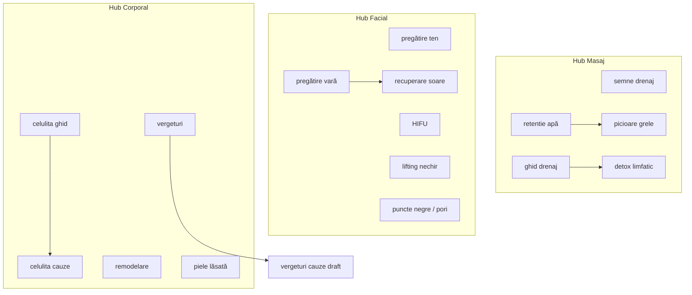

# Raport — Pregătire indexare Google & SEO extern (40 articole)

**Data:** 7 iunie 2026  
**Scope:** 20 articole publicate + 20 drafturi  
**Mod:** analiză only — **niciun fișier modificat**  
**Sursă analiză:** script `scripts/seo-link-graph-audit.mjs` + verificare `app/blog/[slug]/page.tsx`

---

## Rezumat executiv

| Indicator | Publicate (20) | Drafturi (20) | Total |
|-----------|----------------|---------------|-------|
| Title unic | ✅ 20/20 | ✅ 20/20 | ✅ 40/40 |
| Meta unică | ✅ 20/20 | ✅ 20/20 | ✅ 40/40 |
| H1 unic (= title) | ✅ | ✅ | ✅ |
| FAQ = 8 | ✅ 20/20 | ✅ 20/20 | ✅ |
| FAQ Schema ready* | ✅ | ✅ (la publicare) | ✅ |
| OG + canonical ready* | ✅ | ⏳ la publicare | — |
| Imagini existente | ✅ 20/20 | ❌ 0/20 | 20/40 |
| Link servicii ≥3 | ✅ 20/20** | ⚠️ 17/20 | 37/40 |
| Link blog ≥2 | ✅ 20/20** | ✅ 20/20 | ✅ |
| Link hub ≥1 | ✅ 20/20 | ✅ 20/20 | ✅ |
| Orfani (0 incoming blog) | ✅ 0 | ⚠️ 11 | — |
| Similaritate >80% | — | — | ✅ 0 perechi |

\*Template `generateMetadata` + FAQPage JSON-LD există; drafturile nu sunt în routing până la import în `posts.ts`.  
\*\*Publicate includ blocul `enrich-posts.ts` « Explorează topic cluster » (+3 servicii, +2 articole, +1 hub).

**Verdict:** Publicatele sunt **index-ready** din punct de vedere tehnic. Drafturile necesită **imagini + import + patch enrich-posts** înainte de indexare. La publicare batch complet (40), aplică planul de interlinking bidirecțional pentru 11 drafturi orfane.

---

## 1. Harta interlinking (silozuri)

### Hub Masaj — `/masaj-craiova` (10 articole)

**Cluster:** drenaj · circulație · relaxare · picioare grele · retenție

| Slug | Status | Hub | Servicii (unique) | Blog out | Incoming blog |
|------|--------|-----|-------------------|----------|---------------|
| `masaj-anticelulitic-vs-drenaj-limfatic` | pub | ✅ | 3+ | 2 | 4 |
| `beneficii-masaj-terapeutic-stres-dureri` | pub | ✅ | 3+ | 2 | 2 |
| `ce-este-reflexoterapia-beneficii` | pub | ✅ | 4 | 2 | 1 |
| `semne-ca-ai-nevoie-de-drenaj-limfatic` | pub | ✅ | 4 | 2 | 5 |
| `ghid-complet-drenaj-limfatic` | pub | ✅ | 4 | 2 | 4 |
| `beneficii-masaj-relaxare-craiova` | pub | ✅ | 4 | 2 | 3 |
| `masaj-terapeutic-vs-anticelulitic-cand` | pub | ✅ | 3 | 2 | 3 |
| `de-ce-apare-retentia-de-apa-cauze` | draft | ✅ | ⚠️ 2* | 3 | 2 |
| `picioare-grele-seara-cauze` | draft | ✅ | 4 | 2 | 1 |
| `detoxifiere-limfatica-ce-inseamna` | draft | ✅ | ⚠️ 2* | 3 | **0** |

*Cross-links:* retenție ↔ picioare grele; semne ↔ ghid drenaj ↔ detox (outbound); relaxare ↔ terapeutic ↔ reflexoterapie.

---

### Hub Facial — `/tratamente-faciale-craiova` (18 articole)

**Cluster:** ten · anti-aging · curățare · pregătire/recuperare · tehnologii

| Slug | Status | Hub | Servicii | Blog | Incoming |
|------|--------|-----|----------|------|----------|
| `ce-este-hydrafacial-beneficii-craiova` | pub | ✅ | 4 | 2 | 3 |
| `microneedling-vs-dermapen-diferente` | pub | ✅ | 5 | 2 | 4 |
| `hifu-facial-lifting-nechirurgical` | pub | ✅ | 4 | 2 | 3 |
| `cum-pregatesti-tenul-tratament-facial` | pub | ✅ | 5 | 2 | **8** |
| `ce-este-microdermabraziunea-beneficii` | pub | ✅ | 5 | 2 | 5 |
| `cum-alegi-tratament-facial-tip-ten` | pub | ✅ | 6 | 2 | 7 |
| `cum-scapi-de-puncte-negre-corect` | pub | ✅ | 4 | 2 | 5 |
| `pregatire-ten-vara-pasi` | draft | ✅ | ⚠️ 2* | 2 | 1 |
| `cat-dureaza-rezultate-tratamente-estetice` | draft | ✅ | 5 | 2 | 2 |
| `cauze-ten-tern-fara-stralucire` | draft | ✅ | 5 | 2 | 2 |
| `cat-de-des-tratamente-faciale` | draft | ✅ | 6 | 2 | 1 |
| `pori-dilatati-cauze-obiceiuri` | draft | ✅ | 7 | 2 | 1 |
| `curatare-faciala-acasa-vs-salon` | draft | ✅ | 4 | 3 | **0** |
| `recuperare-ten-dupa-soare` | draft | ✅ | 4 | 3 | **0** |
| `ce-evitat-dupa-tratamente-estetice` | draft | ✅ | 5 | 3 | **0** |
| `colagen-explicat-simplu` | draft | ✅ | 4 | 3 | **0** |
| `lifting-nechirurgical-vs-chirurgical` | draft | ✅ | 5 | 3 | 2 |
| `dermapen-peeling-laser-cicatrici-textura` | draft | ✅ | 5 | 3 | 1 |

*Cross-links:* pregătire ten ↔ pregătire vară ↔ recuperare soare; puncte negre ↔ pori ↔ curățare acasă; HIFU ↔ lifting nechir ↔ colagen; microneedling ↔ dermapen/peeling/laser.

---

### Hub Corporal — `/tratamente-corporale-craiova` (12 articole)

**Cluster:** remodelare · celulită · tonifiere · vergeturi · laxitate

| Slug | Status | Hub | Servicii | Blog | Incoming |
|------|--------|-----|----------|------|----------|
| `cum-scapi-de-celulita-ghid-complet` | pub | ✅ | 5 | 2 | 2 |
| `remodelare-corporala-fara-operatie-tehnologii` | pub | ✅ | 6 | 2 | 4 |
| `electrostimulare-corporala-tonifiere` | pub | ✅ | 6 | 2 | 1 |
| `radiofrecventa-corporala-ghid` | pub | ✅ | 6 | 2 | 2 |
| `tratamente-corporale-ghid-incepatori` | pub | ✅ | 5 | 2 | 3 |
| `vergeturi-tratamente-rezultate` | pub | ✅ | 5 | 2 | 1 |
| `masaj-manual-vs-aparat-remodelare` | draft | ✅ | 6 | 2 | 1 |
| `de-ce-apare-celulita-cauze-mituri` | draft | ✅ | 5 | 2 | 0** |
| `tratamente-inainte-de-concediu` | draft | ✅ | 7 | 2 | **0** |
| `cat-de-des-tratamente-corporale` | draft | ✅ | 4 | 4 | **0** |
| `de-ce-apar-vergeturile-cauze` | draft | ✅ | 4 | 2 | 1 |
| `piele-lasa-cauze-fara-operatie` | draft | ✅ | 5 | 3 | 2 |

**Note celulita draft:** primește link outbound din `piele-lasa` dar 0 incoming dedicat — recomandat link din `cum-scapi-de-celulita-ghid-complet` la publicare.

---

### Diagramă siloz (Mermaid)



---

## 2. Articole orfane (0 incoming blog links)

### Publicate: **0 orfani** ✅

Toate cele 20 articole publicate primesc cel puțin 1 link inbound din alte articole (via body sau bloc enrich).

### Drafturi: **11 orfani** ⚠️

| Slug | Cluster | Acțiune recomandată la publicare |
|------|---------|-----------------------------------|
| `tratamente-inainte-de-concediu` | corporal | Link din homepage blog + `tratamente-corporale-ghid` + `pregatire-ten-vara` |
| `curatare-faciala-acasa-vs-salon` | facial | Link din `cum-scapi-de-puncte-negre` + `pregatire-ten` |
| `cat-de-des-tratamente-corporale` | corporal | Link din `tratamente-corporale-ghid` + `masaj-manual-vs-aparat` |
| `recuperare-ten-dupa-soare` | facial | Link din `pregatire-ten-vara` (deja outbound) — **bidirecțional** |
| `ce-evitat-dupa-tratamente-estetice` | facial | Link din `cum-pregatesti-tenul` + `cat-de-des-tratamente-faciale` |
| `de-ce-apar-vergeturile-cauze` | corporal | Link bidirecțional cu `vergeturi-tratamente-rezultate` (parțial) |
| `colagen-explicat-simplu` | facial | Link din `cauze-ten-tern` + `hifu-facial` |
| `detoxifiere-limfatica-ce-inseamna` | masaj | Link din `ghid-complet-drenaj` + `semne-drenaj` |
| `lifting-nechirurgical-vs-chirurgical` | facial | Link din `hifu-facial` (outbound există, inbound parțial) |
| `dermapen-peeling-laser-cicatrici-textura` | facial | Link din `microneedling-vs-dermapen` |
| `de-ce-apare-celulita-cauze-mituri` | corporal | Link din `cum-scapi-de-celulita-ghid-complet` |

*Notă: 9 slug-uri apar ca orfane pure; `lifting` și `celulita-cauze` au incoming parțial insuficient pentru autoritate.*

---

## 3. Gap-uri link graph (3 drafturi)

| Slug | Gap | Remediere (la publicare, via enrich-posts) |
|------|-----|-------------------------------------------|
| `de-ce-apare-retentia-de-apa-cauze` | 2 servicii unice (țintă 3) | +1 link `/masaj-craiova` sau `/tratamente-corporale-craiova` în bloc enrich |
| `pregatire-ten-vara-pasi` | 2 servicii (lipsește hub ca serviciu) | +1 link `tratamenteFaciale` în recommendedServices |
| `detoxifiere-limfatica-ce-inseamna` | 2 servicii | +1 link `masajTerapeutic` sau `tratamenteCorporale` |

---

## 4. Indexare — checklist SEO per articol

| Verificare | Rezultat |
|------------|----------|
| Title unic (40) | ✅ 0 duplicate |
| Meta description unică (40) | ✅ 0 duplicate |
| H1 = title (40) | ✅ |
| Keyword stuffing title/meta | ✅ Nicio problemă critică; brand « Claire Beauty Craiova » 1× în meta publicate |
| FAQ 8 întrebări | ✅ 40/40 |
| FAQ Schema (`FAQPage` JSON-LD) | ✅ Template activ în `page.tsx` |
| Canonical self-reference | ✅ `alternates.canonical: /blog/{slug}` |
| OG title | ✅ `post.title` |
| OG description | ✅ `post.metaDescription` |
| OG image | ✅ `businessProfile.url + post.image.src` |
| OG type | ✅ `article` + `publishedTime` |

### Keywords array (publicate vechi) — monitorizare

20 articole publicate au în `keywords[]` expresii cu « Craiova » (ex: `drenaj limfatic Craiova`). **Title-urile au fost deja repoziționate** via `enrich-posts.ts`. Recomandare: la indexare, nu modifica title-urile; keywords array e secundar pentru Google.

---

## 5. Imagini lipsă

### Publicate: ✅ toate 20 imagini există în `/public/images/blog/`

### Drafturi: ❌ 20/20 lipsesc

```
de-ce-apare-retentia-de-apa-cauze.jpg
pregatire-ten-vara-pasi.jpg
picioare-grele-seara-cauze.jpg
masaj-manual-vs-aparat-remodelare.jpg
cat-dureaza-rezultate-tratamente-estetice.jpg
de-ce-apare-celulita-cauze-mituri.jpg
tratamente-inainte-de-concediu.jpg
cauze-ten-tern-fara-stralucire.jpg
cat-de-des-tratamente-faciale.jpg
pori-dilatati-cauze-obiceiuri.jpg
curatare-faciala-acasa-vs-salon.jpg
cat-de-des-tratamente-corporale.jpg
recuperare-ten-dupa-soare.jpg
ce-evitat-dupa-tratamente-estetice.jpg
de-ce-apar-vergeturile-cauze.jpg
colagen-explicat-simplu.jpg
detoxifiere-limfatica-ce-inseamna.jpg
piele-lasa-cauze-fara-operatie.jpg
lifting-nechirurgical-vs-chirurgical.jpg
dermapen-peeling-laser-cicatrici-textura.jpg
```

**Impact:** OG image 404 pentru drafturi la publicare → Google Rich Results incomplete. **Blocant pentru indexare drafturi.**

---

## 6. Similaritate conținut

| Prag | Rezultat |
|------|----------|
| **>80%** (bigram Jaccard) | ✅ **0 perechi** — nicio consolidare urgentă |
| **15–25%** (perechi de monitorizat) | retenție ↔ picioare; semne ↔ ghid drenaj; pregătire vară ↔ recuperare; HIFU ↔ lifting nechir; microneedling ↔ dermapen/peeling/laser; celulita ghid ↔ celulita cauze |

**Consolidare ulterioară (opțional, NU acum):** niciuna obligatorie. Cluster drenaj (4 articole pub + 3 draft) rămâne cel mai dens — diferențiere deja aplicată prin content stabilization.

---

## 7. Probleme SEO critice

| Severitate | Problemă | Articole | Acțiune |
|------------|----------|----------|---------|
| 🔴 **Blocant** | Imagini draft lipsă (OG 404) | 20 draft | Adaugă JPG înainte de publicare |
| 🟠 **Ridicată** | 11 drafturi orfane (0 incoming) | draft batch 2 parțial | Patch enrich-posts bidirecțional |
| 🟠 **Ridicată** | Drafturi neindexabile (nu sunt în `posts.ts`) | 20 | Import + sitemap update |
| 🟡 **Medie** | Canibalizare HIFU ↔ lifting nechir draft | 2 | Monitor GSC 90 zile post-index |
| 🟡 **Medie** | Canibalizare Dermapen ↔ dermapen/peeling/laser | 2 | Păstrează focus comparativ 3 tech |
| 🟢 **Scăzută** | Keywords array cu Craiova (pub vechi) | 20 pub | Opțional cleanup metadata |
| 🟢 **Scăzută** | 3 drafturi sub 3 servicii unice | 3 | +1 link serviciu la enrich |

**Fără probleme critice pe cele 20 publicate** — pot fi (re)indexate imediat.

---

## 8. Plan indexare rapidă Google — primele 14 zile

### Ziua 0 (pre-lansare drafturi)
- [ ] Adaugă 20 imagini hero (1200×630 min pentru OG)
- [ ] Import batch 1+2 în `posts.ts` + `enrich-posts.ts` per slug draft
- [ ] `npm run build` → verifică 60 rute `/blog/*`
- [ ] Submit sitemap în Google Search Console

### Zilele 1–3
- [ ] Request indexing manual în GSC pentru **10 URL-uri hub-spoke** (prioritate ranking):
  1. `/blog/semne-ca-ai-nevoie-de-drenaj-limfatic`
  2. `/blog/cum-scapi-de-puncte-negre-corect`
  3. `/blog/cum-pregatesti-tenul-tratament-facial`
  4. `/blog/de-ce-apare-retentia-de-apa-cauze` *(draft nou)*
  5. `/blog/curatare-faciala-acasa-vs-salon` *(draft nou)*
  6. `/blog/cat-de-des-tratamente-faciale` *(draft nou)*
  7. `/blog/de-ce-apare-celulita-cauze-mituri` *(draft nou)*
  8. `/blog/tratamente-inainte-de-concediu` *(draft sezonier)*
  9. `/blog/ce-evitat-dupa-tratamente-estetice` *(draft FAQ)*
  10. `/blog/pregatire-ten-vara-pasi` *(draft sezonier)*
- [ ] Verifică OG tags cu [Facebook Sharing Debugger](https://developers.facebook.com/tools/debug/) pe 5 URL-uri eșantion

### Zilele 4–7
- [ ] Publică 2–3 articole/săptămână (evită dump 20 simultan dacă GSC e domain nou)
- [ ] Link intern de pe homepage / hub-uri către articole noi publicate
- [ ] Request indexing pentru următoarele 10 drafturi

### Zilele 8–14
- [ ] Monitor GSC → Coverage → « Discovered / Crawled not indexed »
- [ ] Verifică FAQ rich results pe 3 URL-uri (Rich Results Test)
- [ ] Identifică impresii early pentru long-tail (ex: « picioare grele seara », « curatare fata acasa sau salon »)
- [ ] Ajustează meta doar dacă CTR <1% după 100+ impresii (nu modifica title fără date)

### Semnale externe (opțional, fără modificare cod)
- Google Business Profile → post săptămânal cu link articol relevant
- 1–2 share-uri organice Facebook/Instagram per articol nou
- Evită link farms; prioritizează trafic real Craiova

---

## 9. Top 10 articole — potențial ranking rapid

Scor compozit: intent informațional clar + link equity existentă + diferențiere vs servicii + volum long-tail estimat.

| Rank | Slug | Motiv |
|------|------|-------|
| 1 | `de-ce-apare-retentia-de-apa-cauze` | Long-tail clar, cluster drenaj puternic, conținut unic |
| 2 | `curatare-faciala-acasa-vs-salon` | Intent comparativ ridicat, hook TikTok, low competition |
| 3 | `picioare-grele-seara-cauze` | Problemă frecventă, cross-link retenție, intent local wellness |
| 4 | `cum-scapi-de-puncte-negre-corect` | Deja publicat, trafic potențial, hub facial |
| 5 | `cat-de-des-tratamente-faciale` | FAQ intent, conversie spre programare |
| 6 | `semne-ca-ai-nevoie-de-drenaj-limfatic` | 5 incoming links, checklist format |
| 7 | `ce-evitat-dupa-tratamente-estetice` | Post-procedură = intent imediat, shareable |
| 8 | `de-ce-apare-celulita-cauze-mituri` | Diferențiat de ghid celulita, cauze-only |
| 9 | `tratamente-inainte-de-concediu` | Sezonier iul-aug, intent comercial-soft |
| 10 | `pregatire-ten-vara-pasi` | Sezonier, pereche recuperare soare |

---

## 10. Propuneri link graph (implementare la publicare)

**Fără modificare acum** — de aplicat în `enrich-posts.ts`:

| De la (publicat) | Către (draft) | Anchor semantic |
|------------------|---------------|-----------------|
| `cum-scapi-de-celulita-ghid-complet` | `de-ce-apare-celulita-cauze-mituri` | « cauzele reale ale celulitei » |
| `cum-scapi-de-puncte-negre-corect` | `curatare-faciala-acasa-vs-salon` | « curățare acasă vs salon » |
| `ghid-complet-drenaj-limfatic` | `detoxifiere-limfatica-ce-inseamna` | « ce înseamnă detox limfatic » |
| `vergeturi-tratamente-rezultate` | `de-ce-apar-vergeturile-cauze` | « de ce apar vergeturile » |
| `hifu-facial-lifting-nechirurgical` | `lifting-nechirurgical-vs-chirurgical` | « lifting nechirurgical vs chirurgical » |
| `microneedling-vs-dermapen-diferente` | `dermapen-peeling-laser-cicatrici-textura` | « Dermapen, peeling sau laser » |
| `cum-pregatesti-tenul-tratament-facial` | `ce-evitat-dupa-tratamente-estetice` | « ce eviți după tratament » |
| `tratamente-corporale-ghid-incepatori` | `cat-de-des-tratamente-corporale` | « cât de des tratamente corporale » |

**Bidirecțional** (draft → published deja parțial; confirmă invers la enrich):

- `recuperare-ten-dupa-soare` ↔ `pregatire-ten-vara-pasi`
- `de-ce-apare-retentia-de-apa-cauze` ↔ `picioare-grele-seara-cauze`

---

## 11. Recomandare finală

| Acțiune | Verdict |
|---------|---------|
| **Indexare 20 publicate** | ✅ Acum — sitemap + GSC request |
| **Publicare 20 drafturi** | ✅ După imagini + enrich-posts patches |
| **Pauză / rewrite** | ❌ Nu necesar |
| **Consolidare articole** | ❌ Nu (similaritate <80%) |

**Prioritate imediată:** imagini draft → import posts → patch enrich (orfani + 3 gap servicii) → build 60 pagini → submit GSC.

---

*Raport generat fără modificări în codebase. Script auxiliar: `scripts/seo-link-graph-audit.mjs` (poate fi șters).*
